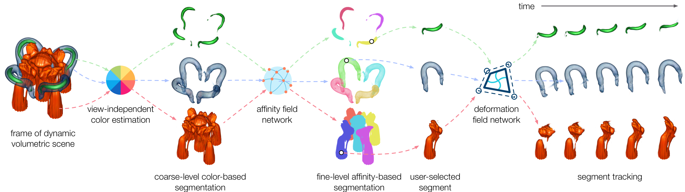

# VolSegGS: Segmentation and Tracking in Dynamic Volumetric Scenes via Deformable 3D Gaussians

[Paper](https://arxiv.org/abs/2507.12667) | [Demo](https://youtu.be/u1u8bLvSdzE)



This repository contains the official implementation associated with the paper "VolSegGS: Segmentation and Tracking in Dynamic Volumetric Scenes via Deformable 3D Gaussians".

## Run

### Environment

```shell
git clone https://github.com/JCBreath/VolSegGS
cd VolSegGS

conda create -n vsgs python=3.9
conda activate vsgs

# install pytorch
conda install -c nvidia/label/cuda-12.8.1 cuda-toolkit
python -m pip install torch torchvision torchaudio --index-url https://download.pytorch.org/whl/cu128
conda install gxx_linux-64

# install submodules
cd VolSegGS
python -m pip install submodules/simple-knn/
python -m pip install submodules/diff-gaussian-rasterization

# install dependencies
python -m pip install imageio tqdm scipy plyfile open3d numpy==1.24
python -m pip install opencv-python dearpygui 
python -m pip install lpips
python -m pip install mmcv
```

### Train

```shell
python train.py -s data/vortex --expname "vortex" --configs arguments/dynerf/dnerf_default_visnerf.py
```

### View & Segmentation with GUI

```shell
python gui.py --model_path output/vortex/
```

For instructions, please watch this [demo](https://youtu.be/u1u8bLvSdzE).

## Citation

```
@article{Yao-VolSegGS-VIS25,
  author={Yao, Siyuan and Wang, Chaoli},
  journal={ IEEE Transactions on Visualization \& Computer Graphics },
  title={{ VolSegGS: Segmentation and Tracking in Dynamic Volumetric Scenes via Deformable 3D Gaussians }},
  year={2026},
  volume={32},
  number={01},
  ISSN={1941-0506},
  pages={407-417},
  doi={10.1109/TVCG.2025.3642516},
  url = {https://doi.ieeecomputersociety.org/10.1109/TVCG.2025.3642516}
}
```

## Acknowledgements

This research was supported in part by the U.S. National Science Foundation through grants IIS-1955395, IIS-2101696, OAC-2104158, and IIS-2401144, and the U.S. Department of Energy through grant DE-SC0023145.


